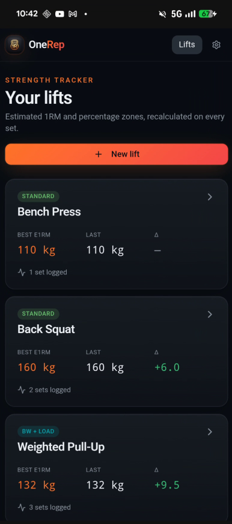

# OneRep — Strength & 1RM Tracker

OneRep is a high-performance, minimalist strength tracking application designed for serious lifters. It focuses on estimated 1RM (One Rep Max) progression and provides real-time percentage-based training zones.



## Features

- **Live 1RM Engine:** Instant calculations using industry-standard formulas (Epley, Brzycki, Lombardi, O'Conner).
- **Hybrid Load Support:** Perfect for weighted calisthenics (Pull-ups, Dips). Automatically calculates `Total Load = Bodyweight + Added Weight`.
- **Percentage Zones:** Automatically generates a live table from 60% to 105% of your max.
- **History & Progression:** Track your strength gains over time with interactive charts.
- **Mobile Ready:** Built with Capacitor for a native Android/iOS experience.
- **Privacy First:** All data is stored locally in your browser/device.

## Tech Stack

- **Framework:** [React 19](https://react.dev/)
- **Routing:** [TanStack Router](https://tanstack.com/router)
- **Styling:** [Tailwind CSS 4.0](https://tailwindcss.com/)
- **Mobile Bridge:** [Capacitor](https://capacitorjs.com/)
- **Icons:** [Lucide React](https://lucide.dev/)
- **Charts:** [Recharts](https://recharts.org/)

## Local Development

### Prerequisites
- [Bun](https://bun.sh/) (recommended) or Node.js

### Setup
1. Clone the repository:
   ```bash
   git clone https://github.com/rwickel/strength-tracker-pro.git
   cd strength-tracker-pro
   ```

2. Install dependencies:
   ```bash
   npm install
   ```

3. Start the development server:
   ```bash
   npm run dev
   ```

## Mobile Build (Android)

1. Build the production web assets:
   ```bash
   npm run build
   ```

2. Sync with Capacitor:
   ```bash
   npx cap sync
   ```

3. Open in Android Studio:
   ```bash
   npx cap open android
   ```

### Finding your APK
After building the project in Android Studio (Build > Build APK), you can find the final application file at:
`android/app/build/outputs/apk/debug/app-debug.apk`

## License
MIT
