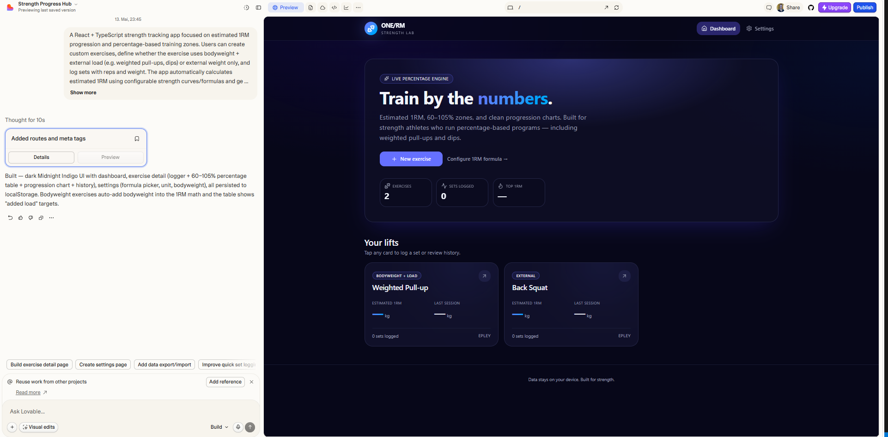
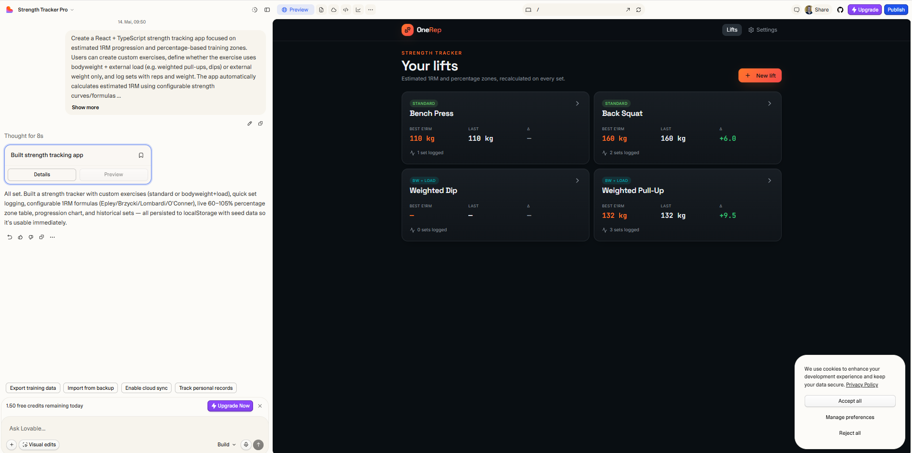
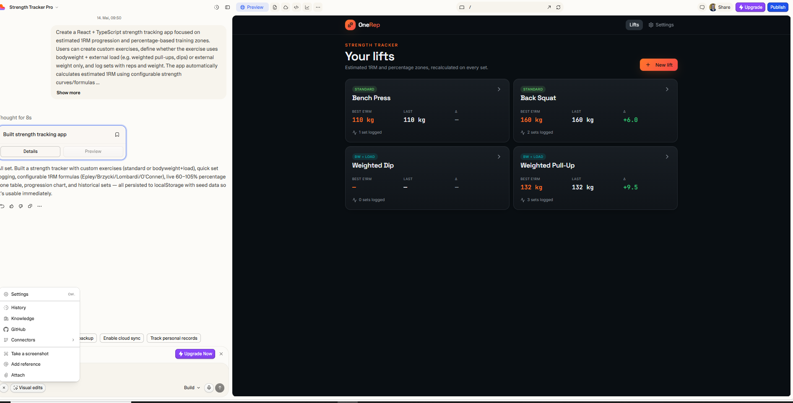
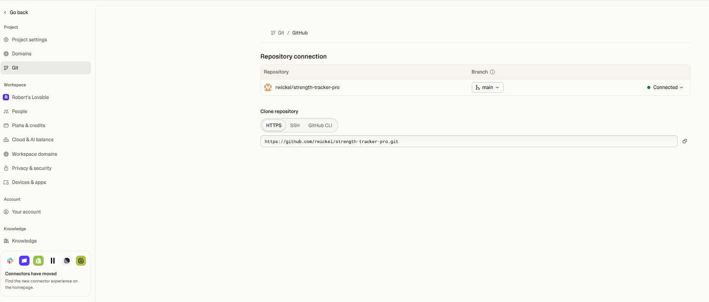
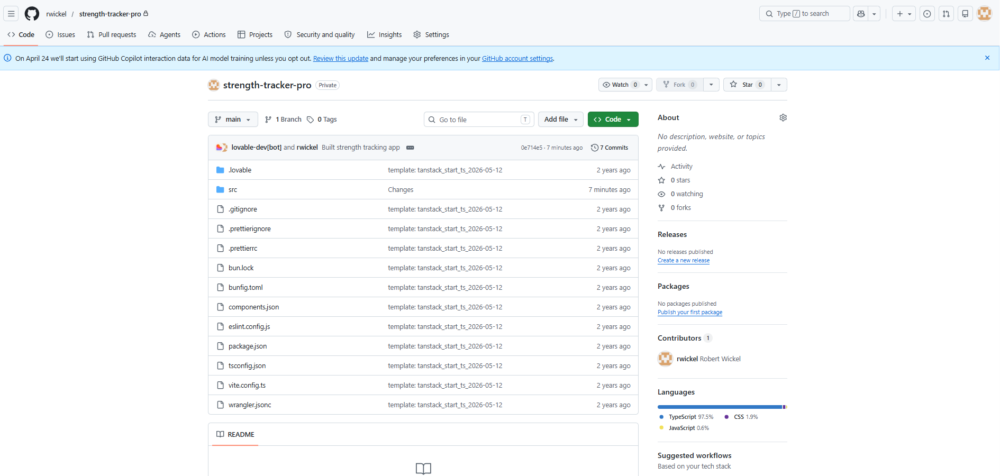
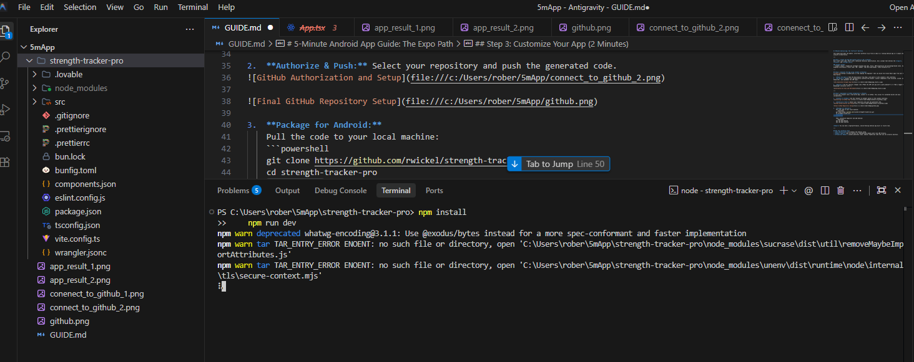
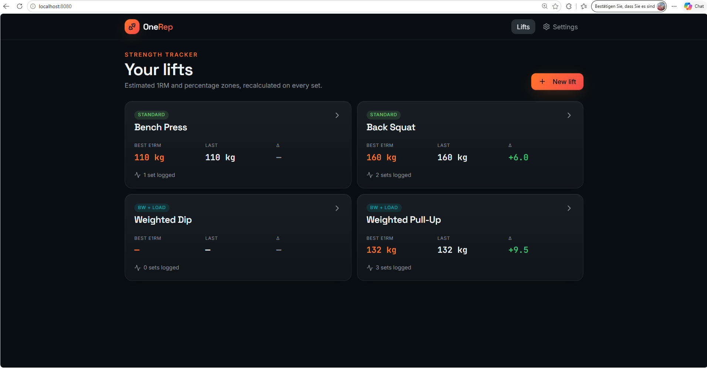
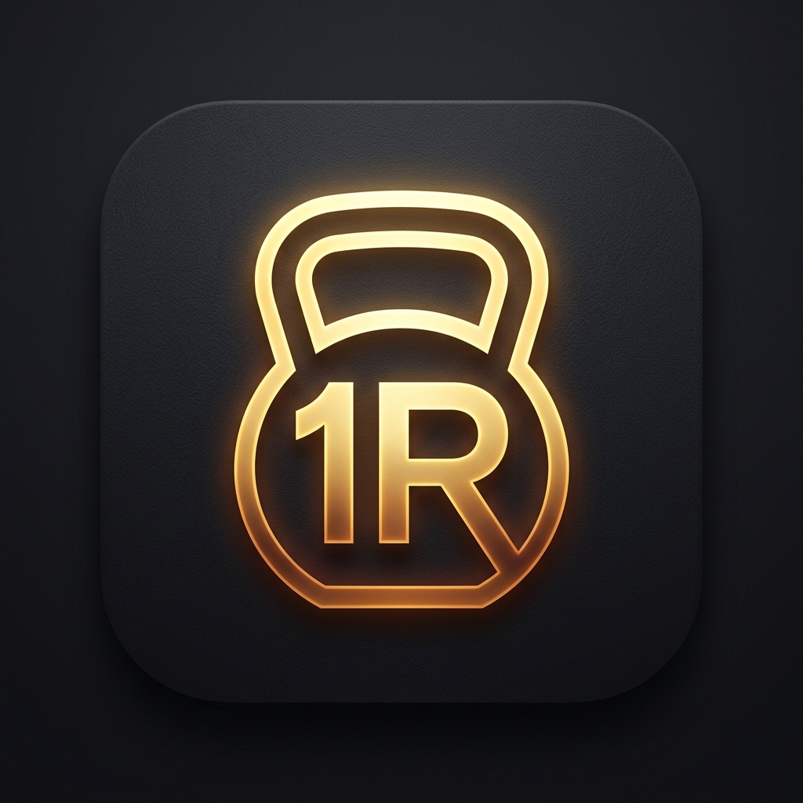
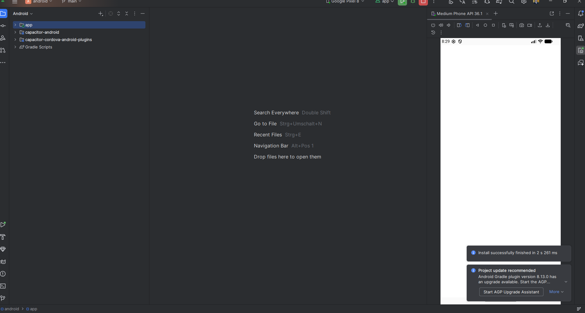
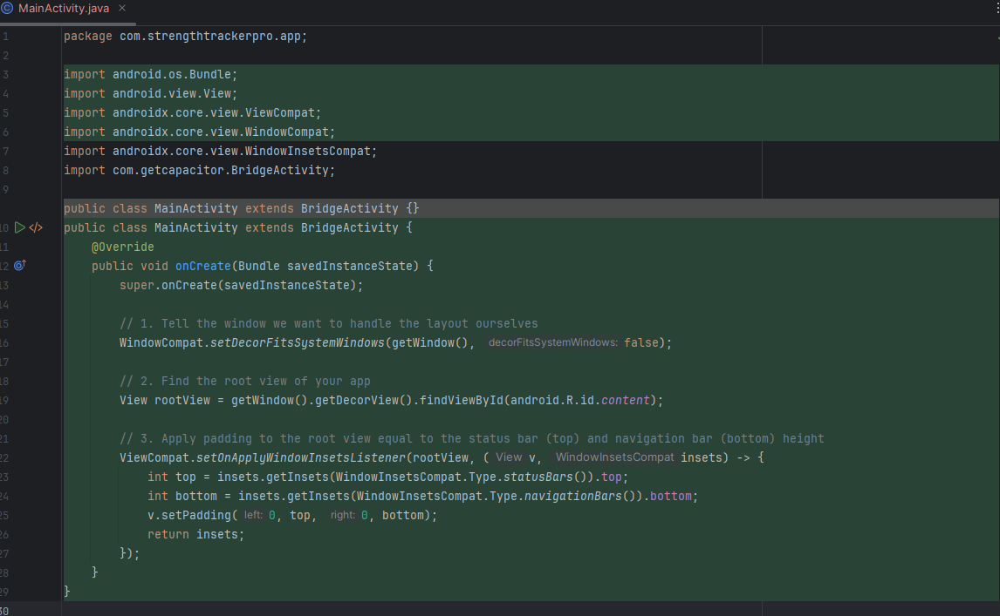

# 5-Minute Android App: The "AI-First" Workflow

This guide describes the modern, ultra-fast workflow to go from an idea to a running Android app in 3 simple steps using AI orchestration.

---

## Step 1: Create the App Description with an LLM (1 Minute)
Don't start with code. Start with a detailed technical specification. Use a prompt that defines the **logic**, **stack**, and **target user**.
```
A React + TypeScript strength tracking app focused on estimated 1RM progression and percentage-based training zones. Users can create custom exercises, define whether the exercise uses bodyweight + external load (e.g. weighted pull-ups, dips) or external weight only, and log sets with reps and weight. The app automatically calculates estimated 1RM using configurable strength curves/formulas and generates a live percentage table from 60%–105% of max in 5% increments.

Example:
Weighted pull-up with 80kg bodyweight + 52kg external load = 132kg total system 1RM. If the user logs 30kg × 6 reps, the app estimates updated 1RM values and recalculates all percentage targets automatically.

Core features:

Create/edit/delete exercises

Support bodyweight-inclusive and standard lifts

Log reps, sets, added weight, and bodyweight

Automatic estimated 1RM calculation

Percentage overview table (60%–105%)

Historical progression tracking

Exercise dashboard/cards

Mobile-friendly UI with charts and quick logging

Local storage or cloud sync support

Configurable 1RM formulas (Epley, Brzycki, etc.)

Clean fitness-focused interface using React + TypeScript + charts

Target users: strength athletes, calisthenics athletes, weighted pull-up/dip trainees, and powerlifters who train with percentage-based programming.
```

---

## Step 2: Generate the App using Lovable (3 Minutes)
[Lovable.dev](https://lovable.dev) is the leading "AI Engineer" that can build full-stack React apps from your Step 1 description.

1.  **Paste the Spec:** Take the description from Step 1 and paste it into Lovable's chat interface.
2.  **AI Build:** Lovable will automatically scaffold the project, install components (like Tailwind, Lucide, and Shadcn/UI), and implement the 1RM logic.
    - **Live 1RM Engine:** Real-time calculations using Epley/Brzycki formulas.
    - **Hybrid Load Support:** Correct math for Weighted Pull-ups (Bodyweight + Added).
    - **Set Management:** Full CRUD support (Log, View, Edit weight/reps/date, and Delete).
    - **Unit Intelligence:** Seamless switching between kg/lb across the entire UI.



3.  **Refine:** Ask for specific changes like *"Make the 1RM card pop with a gold gradient"* or *"Add a toggle for Bodyweight inclusive lifts."*



---

## Step 3: Deployment & GitHub Integration (1 Minute)
To turn your project into a real-world app, connect it to GitHub. This allows for automated builds and easy collaboration.

1.  **Connect to GitHub:** Use the "Connect to GitHub" button in the Lovable interface.


2.  **Authorize & Push:** Select your repository and push the generated code.


3.  **Verify:** Your code is now live on GitHub and ready for local development.


---

## Step 4: Local Development Setup
Once your code is on GitHub, it's time to bring it to your local environment for final packaging.

1.  **Clone and Install:**
    Open your terminal and run:
    ```powershell
    git clone https://github.com/rwickel/strength-tracker-pro.git
    cd strength-tracker-pro
    npm install
    ```

2.  **Verify the Build:**
    Launch the development server to ensure everything transitioned correctly:
    ```powershell
    npm run dev
    ```





---

## Step 5: Designing the App Icon (Optional)
A premium app needs a premium icon. We used AI to generate a minimalist, high-contrast icon that matches the "OneRep" dark mode aesthetic.



**How to Apply the Icon:**
1.  **Prepare Assets:** Save your icon as `icon-only.png` and a background as `background.png` in an `assets/` folder.
2.  **Use Capacitor Assets:** Run the following tool to generate all required Android sizes automatically:
    ```powershell
    npm install -D @capacitor/assets
    npx @capacitor/assets generate --android
    ```

---

## Step 6: Packaging for Android (The Capacitor Flow)
To turn your web app into a native Android application, we use **Capacitor**. It wraps your code in a native container and provides access to hardware features.

1.  **Build your Production Assets:**
    First, generate the optimized web code that will be embedded in the app.
    ```powershell
    npm run build
    ```
    *Note: For mobile apps, we convert the app to a SPA (Single Page Application) mode.*

2.  **Initialize Capacitor:**
    ```powershell
    npx cap init "Strength Tracker Pro" "com.strengthtrackerpro.app" --web-dir dist
    ```

3.  **Add the Android Platform:**
    ```powershell
    npx cap add android
    ```

4.  **Sync and Open:**
    ```powershell
    npx cap sync
    npx cap open android
    ```



**Boom!** Android Studio will launch your project, allowing you to run it on a real device or emulator.

> [!TIP]
> **Find your APK:** After building the project in Android Studio (Build > Build APK), you can find the final application file at:
> `android/app/build/outputs/apk/debug/app-debug.apk`


## Step 6: Polishing the Android Experience (Edge-to-Edge)
To make your app feel truly native, you should enable "Edge-to-Edge" display. This ensures your app content flows behind the status bar and navigation bar.



**Key Optimization:**
Modify your `MainActivity.java` in Android Studio to include window inset listeners. This prevents the UI from being cut off by the phone's status bar or notch, providing a premium, full-screen experience.

---

## The Final Result: A Native Strength Tracker
After following this 3-step workflow (and a few minutes of polishing), you have a production-ready, branded Android app.


---

